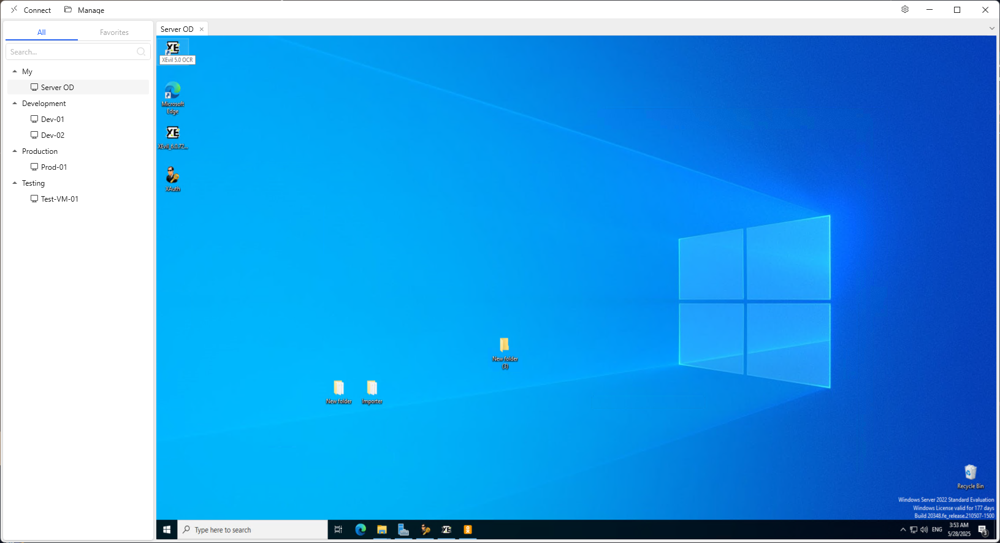
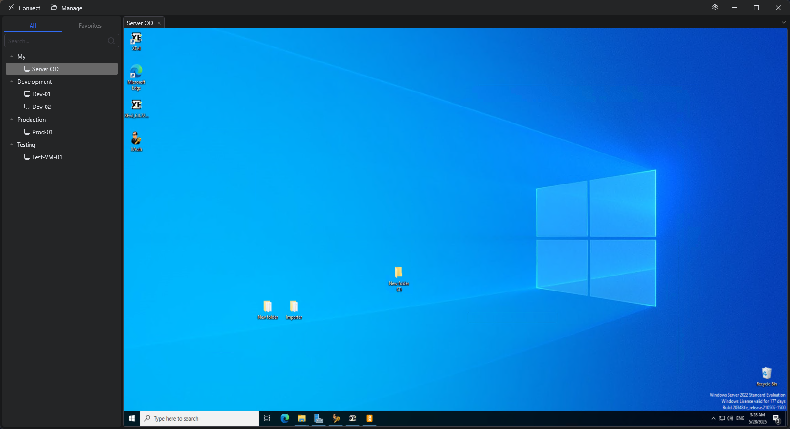

## Remote Desktop Manager

A desktop application for managing and connecting to multiple remote desktop (RDP) sessions using the built-in Windows Remote Desktop ActiveX client.

### Features

- Manage server groups and individual RDP connections
- Support for multiple concurrent connections via tabbed interface (`AvalonDock`)
- SmartSizing support for dynamic RDP scaling

> Built with `AxInterop.MSTSCLib.dll` and `Interop.MSTSCLib.dll` — COM-based ActiveX libraries for Microsoft RDP client integration.

### Preview
| Light Theme | Dark Theme |
|------------|-------------|
|  |  |

### Installation
1. Download the latest release from [Releases](https://github.com/Rckov/Remote-Desktop/releases/latest).
2. Extract the ZIP archive to your preferred directory.
3. Run `Remote Desktop.exe`.  

### Suggestions
Feel free to create an issue if you have any suggestions or ideas to improve the application.

### License
Licensed under [MIT](LICENSE). [Report an Issue](https://github.com/Rckov/Xslt-Editor/issues)
